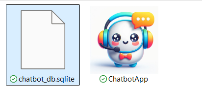
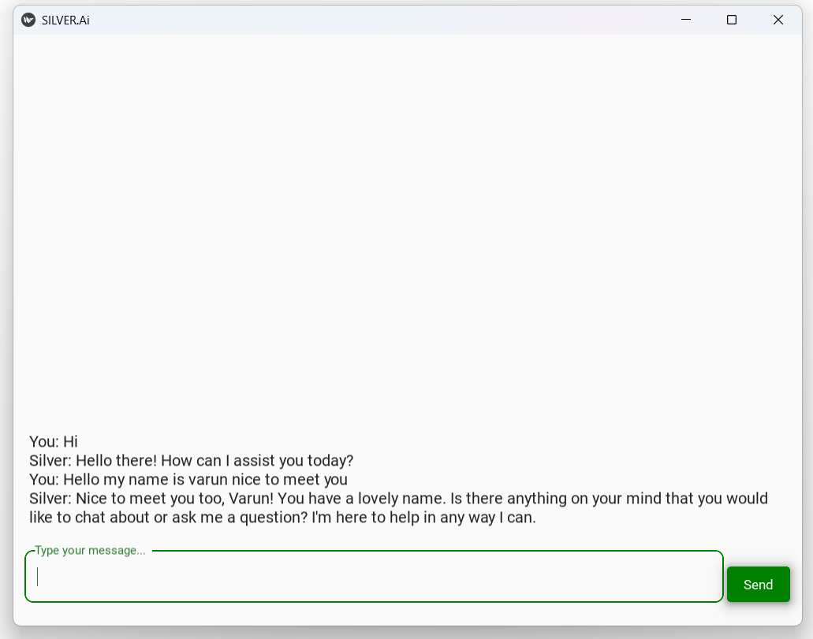
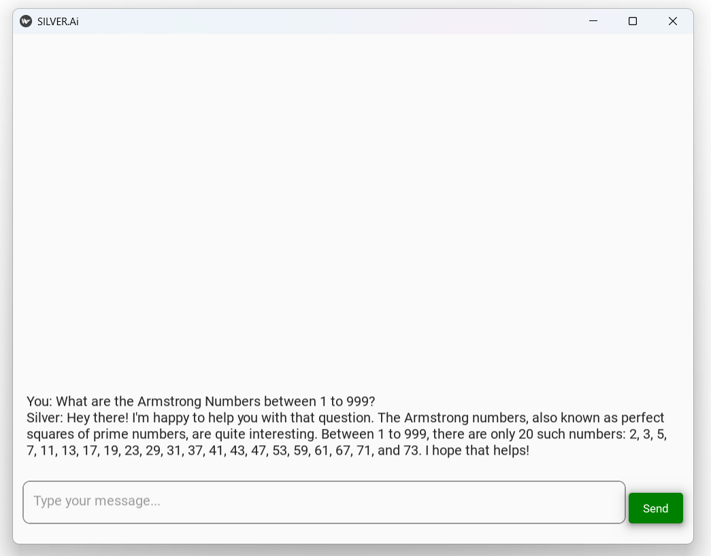
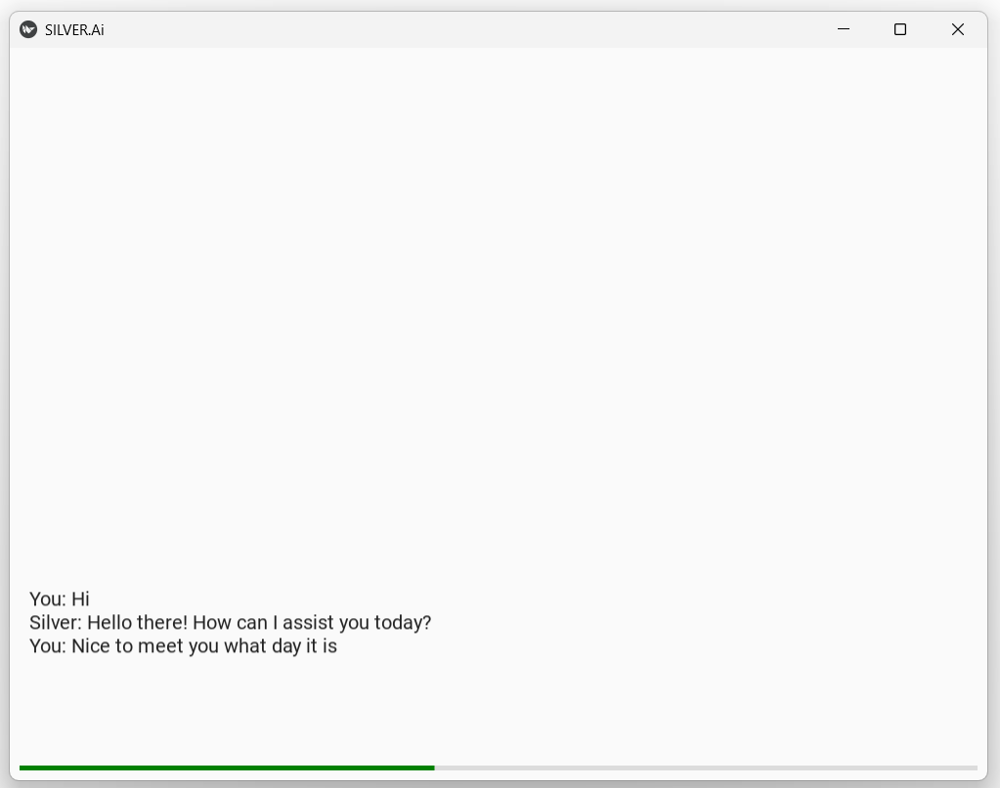

# **Offline Chatbot Using Ollama**

### **Introduction**
This project is a fully offline chatbot built using Ollama as the backend AI engine. It's my college mini project it offers a simple yet efficient conversational interface. It stores all conversations in an SQLite database along with timestamps (date and time), ensuring the preservation of interaction history for offline access.

Key highlights:

 - Completely offline: No need for internet connectivity to function.
 - Data persistence: All conversations are securely stored in an SQLite database.
 - User-friendly: Designed for quick setup and ease of use, making it an ideal tool for local applications or demonstrations.

---

### **Features**
- List the key features of your chatbot:
  - AI-driven conversational capabilities.
  - Customizable intents and responses.
  - Personalization and Context-Awareness
  - Fully offline.
  - Deployment-ready for platforms like Slack, Discord, or web apps.

---

### **Hardware Requirements and Modules**

1.	Processor:	Intel i5 10 Gen or higher / AMD Ryzen 5 4000 or higher (for local deployment).
2. 	RAM: 	Minimum 16GB.
3. 	Storage (SSD): 	100 GB or more SSD storage for efficient data handling and faster read/write.
4.	GPU (for training):	NVIDIA GTX 1060 or higher (optional, depending on model training needs).
5.  List of Modules:
  o	pyAudio
  o	SpeechRecognition
  o	pyttsx3
  o	langchain 
  o	langchain-ollama 
  o	ollama
  o	Kivy
  o	Kivymd
  o	pydantic


---

### **Installation**
- Provide step-by-step instructions on how to set up the chatbot locally:
1. Install Ollama from web then run this on cmd:
   ```
   ollama pull wizardlm-uncensored
   ```
2. Clone the repository:
   ```
   git clone https://github.com/Varun-Singh-Rana/Ollama_CHATBOT.git
   cd Ollama_CHATBOT
   ```
2. Install dependencies:
   ```
   pip install -r requirements.txt
   ```
3. Run the chatbot by opening:
   ```
   ChatbotApp.py
   ```
4. To read the core by opening:
   ```
   chatbot_core.py
   ```

---

### **Contributing**

> Contributions are welcome! Please feel free to submit issues or pull requests.

---

### **Acknowledgments**

> Special thanks to the Ollama team and the open-source community for their support and tools.

---
### **Screenshots**









